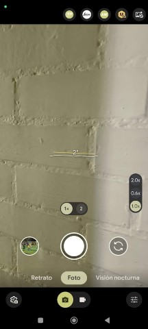

# GCAM-XML-AGC
Configuration files for tested GCAM

## BigKaKa AGC 9.1
[apk](https://www.celsoazevedo.com/files/android/google-camera/dev-BigKaka/f/dl50/)  
[Xiaomi 13T config](Xiaomi13T/AGC9.1_Xiaomi13T.agc)  
  
*Known issues*
- Slow motion only works with the main camera (it forces close if another camera is selected)
- Sphere mode doesn't work with any camera  

